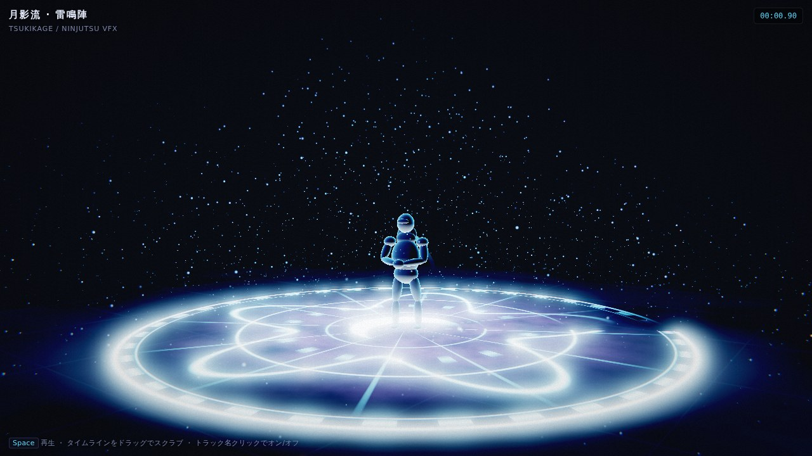
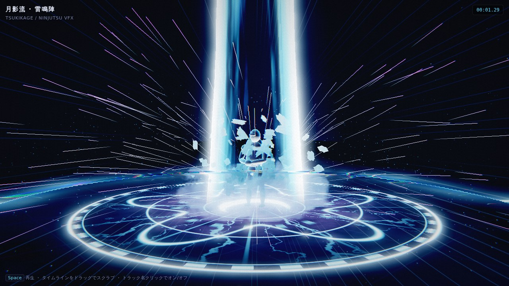
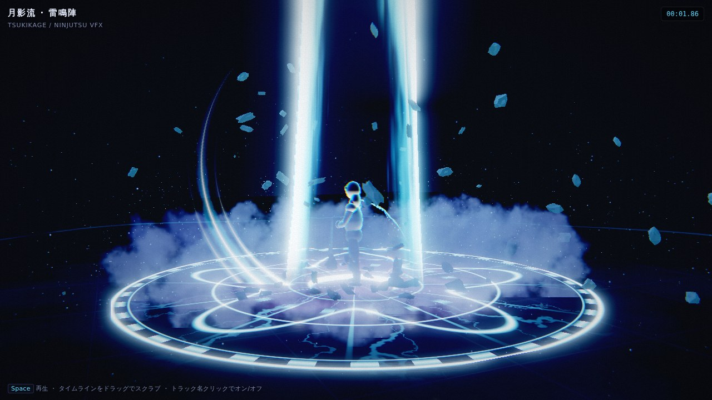

# 06_VFX — 忍術VFX（月影流・雷鳴陣）

`ninjutsu_vfx_editor.html` は **依存ライブラリなしの単一HTML**。
ブラウザで開くだけで動く VFX 制作環境で、構成は 2 段構え。

- **Animation Editor**（下部タイムライン）: 11 トラックのクリップを時間軸に並べて演出を組む
- **Composer**（右パネル）: Bloom → Streak → Distortion → Grade → CA → Vignette → Grain のポストチェーン

実装は WebGL2 の生 API。シーンを HDR バッファに描き、明部抽出 → 1/2・1/4・1/8 の 3 段ガウス → 合成、
という Unity の URP Volume と同じ構造にしてある。

## プレビュー

| 集束 (0.9s) | 発破 (1.25s) | 斬撃 (1.8s) |
|---|---|---|
|  |  |  |

通しの動画: [`preview/tsukikage_raiden.webm`](preview/tsukikage_raiden.webm)（雷）／
[`preview/tsukikage_enbu.webm`](preview/tsukikage_enbu.webm)（炎） — 1280x720 / 30fps / 約 3.5s

## v2 で入れた「ゲーム品質」の要素

FF7 リバース系の技 VFX に共通する文法を、そのまま実装に落としている。

| 要素 | 実装 | 効き |
|---|---|---|
| 熱色ランプ | `ramp()`: 暗縁 → 主色 → 高輝度 → 白 の 4 段グラデ | 「白く飛ぶ」ではなく色の層で発光を見せる |
| アルファエロージョン | `erode(noise, threshold, soft)`: 閾値を上げて千切れて消える | 光柱・斬撃・煙・術式陣の消え際 |
| 半透明レイヤー | premultiplied blend。加算は粒子と術式陣だけ | 暗縁と重なりの奥行きが出る |
| 煙・破片 | ビルボード煙 64 枚（発光色でライティング）＋ 放物線を飛ぶ破片 90 個 | 物理的な重さ |
| 地割れ・焦げ跡 | 地面シェーダーに放射状スポーク＋発光の減衰 | 技が「地面に残る」 |
| 屈折歪み | 半解像度の歪みバッファ（衝撃波の放射／光柱の熱揺らぎ）を合成時に適用 | 空気が揺れる |
| ヒットストップ | 1.05s から 0.032s 区間を約 1/5 速で進める | 当たった手応え |
| インパクトフレーム | 発破の頭 3〜4 フレームをシルエット白飛び＋高コントラスト脱色 | 一瞬の「絵」 |
| スピードライン | 画面中心から放射する線を合成段で加算 | 発破の勢い |
| アナモルフィック | 1/4 解像度の明部を横に 3 回引き伸ばす | 高輝度が横に伸びる |
| カメラ | 集束で寄り → 発破で蹴り返し＋シェイク → 回り込み | 演出としての一体感 |
| キャラ | 集束で沈み、発破で跳ね、斬撃で体をひねる | 技を「撃っている」ように見える |
| 曲面ジオメトリ | キャラは楕円体＋テーパーカプセル＋なびくリボン、破片は頂点を揺らした正二十面体 | 箱や立方体の直線が画面に出ない |

## 使い方

1. HTML をブラウザで開く（ローカルファイルのままで可）
2. `Space` または ▶ で再生。タイムラインをドラッグでスクラブ
3. トラック名をクリックで **オン/オフ**、隣のスライダーで **そのレイヤーの強度**
4. 右パネルで Bloom・Impact・グレード・カメラを追い込む。ヒットストップはボタンで切替
5. `PNG を保存` / `WebM 録画（1ループ）` で書き出し

## タイムライン構成（3.40s / ループ）

| トラック | 時間 | 内容 | Unity での実装先 |
|---|---|---|---|
| 火の粉 / Embers | 0.00–3.40 | 常時漂う霊気の粒 | ParticleSystem（ループ・低密度） |
| 集束 / Charge | 0.00–1.18 | 内側へ巻き込む収束粒子 | ParticleSystem + Velocity over Lifetime（Orbital） |
| 術式陣 / Sigil | 0.12–2.95 | 月桜紋の魔法陣。角度スイープで描き起こし、エロージョンで消える | Shader Graph（極座標＋リング＋Dissolve）を Quad に |
| 発破 / Burst | 1.05–1.42 | フラッシュ＋インパクトフレーム＋スピードライン＋シェイク | Volume の一時的な露出上げ＋Fullscreen Shader＋Cinemachine Impulse |
| 衝撃波 / Shockwave | 1.06–1.95 | 地面を走る帯（半透明・暗縁）＋屈折 | Shader Graph（半径アニメ＋Dissolve）＋ Distortion（Scene Color 参照） |
| 光柱 / Pillar | 1.02–2.45 | 天へ抜ける柱。上から千切れて消える | 円柱メッシュ＋スクロールノイズ＋Dissolve＋Fresnel |
| 煙 / Smoke | 1.06–2.90 | 発光色で照らされた半透明の煙 | ParticleSystem（Alpha Blend, Lit Particle） |
| 破片 / Debris | 1.06–2.60 | 回転しながら放物線を飛ぶ岩片 | ParticleSystem（Mesh Renderer, Gravity） |
| 地割れ / Cracks | 1.05–3.40 | 放射状のひび＋焦げ跡。発光が減衰 | Decal Projector（Emission アニメ） |
| 斬撃 / Slash | 1.52–2.02 | 主刃＋副刃 2 本の三日月トレイル。尾は千切れる | ビルボードのアーチメッシュ×3＋UV スイープ＋Dissolve |
| 火花 / Sparks | 1.06–1.85 | 放射状の線状火花 | ParticleSystem（Stretched Billboard） |

各レイヤーは「クリップ内 0→1 の正規化時間」だけを受け取って描く作りなので、
クリップの時間を動かすだけでタイミングを作り直せる。

## プリセット

| | ベース | 用途 |
|---|---|---|
| 雷 Raiden | シアン＋青白（暗縁は藍） | 本編の基準色（ArtDirection のエフェクトカラーに準拠） |
| 炎 Enbu | 橙＋深紅（暗縁は暗赤） | 火遁系 |
| 桜 Sakura | 桃＋金（暗縁は紫） | 演出・イベント用 |

パレットは `PRESETS` 配列（edge / mid / core / rim / amb / smoke の 6 色）を差し替えるだけで増やせる。

## Unity へ持っていく手順

1. 各トラックを 1 ParticleSystem / 1 Shader Graph に分解（上表の対応）
2. タイミングは Timeline（または Animator）に同じ秒数でクリップを置く。ヒットストップは `Time.timeScale` を 1.05s から 0.15 秒だけ 0.2 にする
3. ポストは URP Volume に Bloom / Color Adjustments / Chromatic Aberration / Vignette / Film Grain を作り、右パネルの数値をそのまま初期値にする。歪みは Fullscreen Shader Graph（Scene Color を UV オフセットでサンプル）
4. 発破のカメラシェイクは Cinemachine Impulse Source を 1.05s に配置

## 既知の制約

- `EXT_color_buffer_float` があれば RGBA16F、無ければ RGBA8 に自動フォールバック（その場合は屈折歪みがオフ）
- 録画は `MediaRecorder`（WebM/VP9）。mp4 が必要なら書き出し後に変換する
